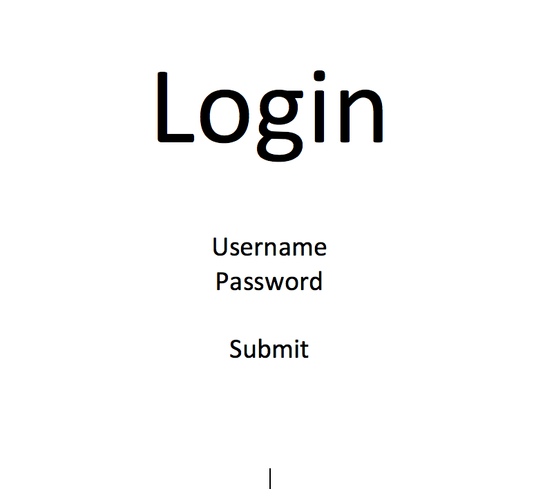
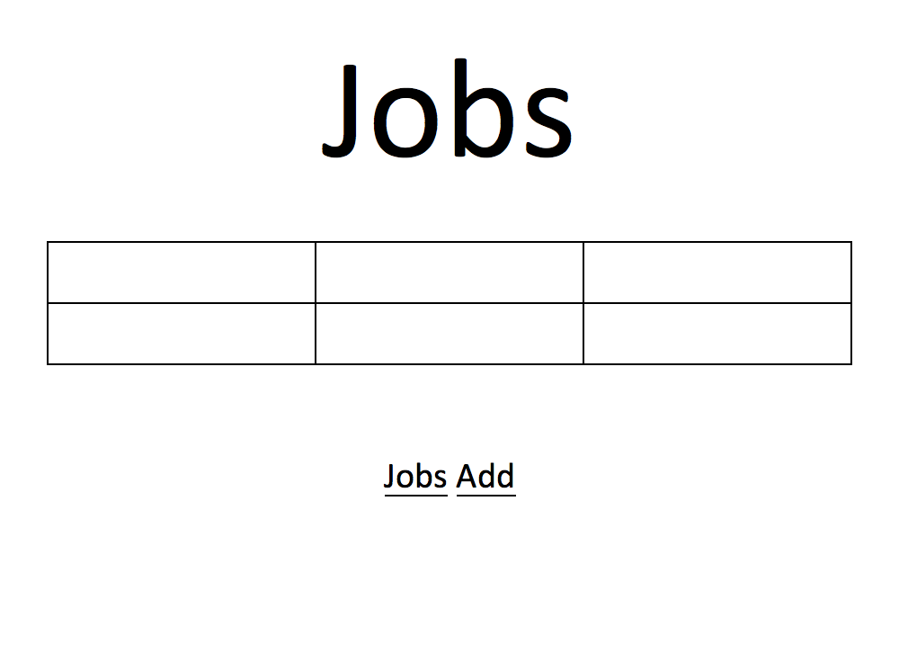
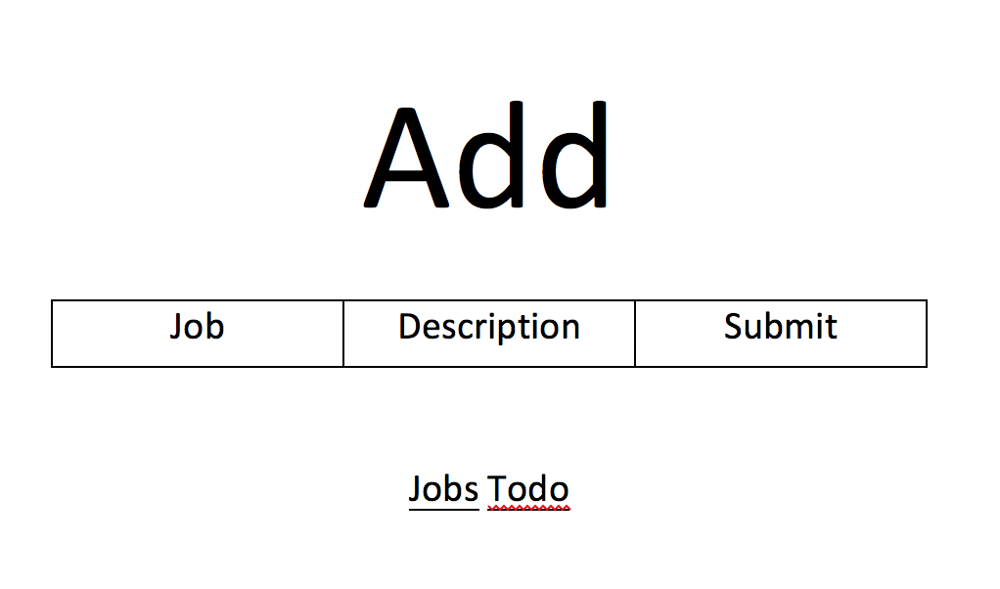
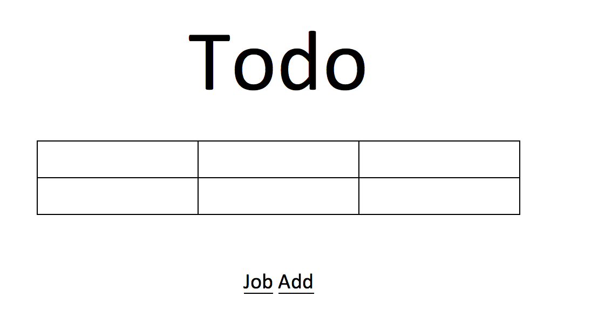
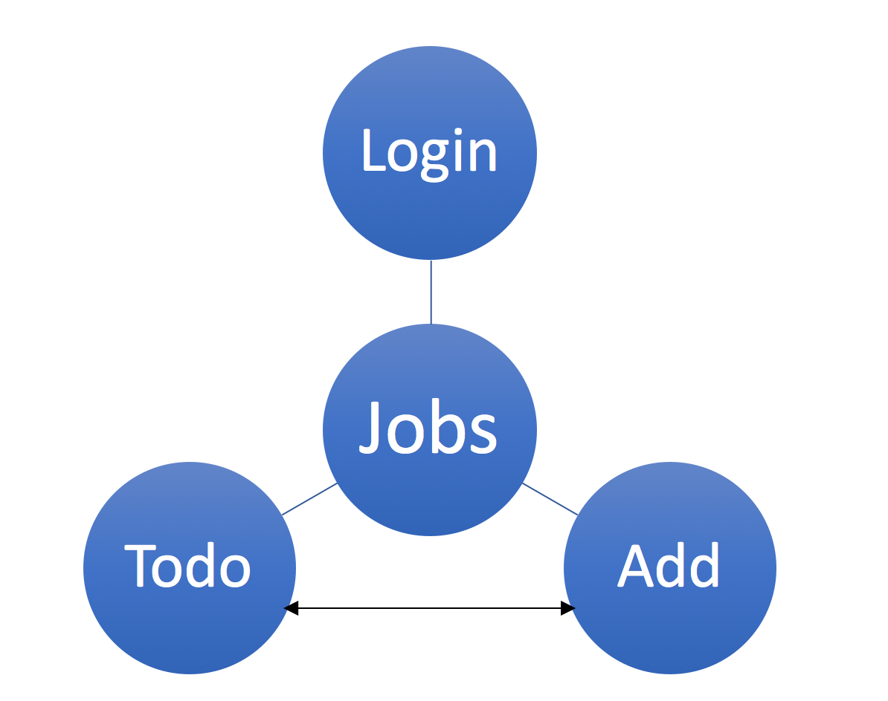

# My Job Hub! 

## Overview


My Job Hub is a web applicationt to aloow users to keep track of which jobs you've applied to! Users can register and login. Once they're logged in, they can add to there list of job applictions. For past jobs in the list you update the status of the job. Additionally, you can make a todo list of jobs to apply to. You can also filter the applications based off location, company, and type. 

## Data Model

The application will store Users and a list of Jobs

* each user has one list

An Example User:

```javascript
{
  username: "jobhunter",
  hash: // a password hash,
  Jobs:// an array of references to Job documents
}
```

An Example Job with Embedded Items:

```javascript
{
  company: "NBA"
  position: "Professional Basketball Player"
  status: "Pending"
  dateApplied: "10/2/17"
  link: "wwww.nba.com/careers"

}
```


## [Link to Commented First Draft Schema](src/db.js) 


## Wireframes

/ - login page



/jobs - page for showing all jobs applied, and filtering



/add - page for adding jobs



/todo - page for adding jobs to apply to 



## Site map



Login takes you to jobs.
From jobs you can go to todo and add
From add you can go to jobs and todo
From todo you can go to add and jobs

## User Stories or Use Cases

1. as non-registered user, I can register a new account with the site
2. as a user, I can log in to the site
3. as a user, I can view jobs I applied to
4. as a user, I can add jobs I will apply to 
5. as a user, I can change the status of Todo jobs to Applied

## Research Topics
Update 11/9/2017 

* (5 points) Integrate user authentication
    * I'm going to be using passport for user authentication
    * An account will be  made for testing; I'll email you the password
* (1 Point) Google Fonts
  * I will used an external font
* (2 points) Use a CSS framework throughout your site
	* I will be using boostrap to allow my sit to be responsive


Foundation
8 points total out of 8 required points


## [Link to Initial Main Project File](src/app.js) 

## Annotations / References Used

1. None so far!